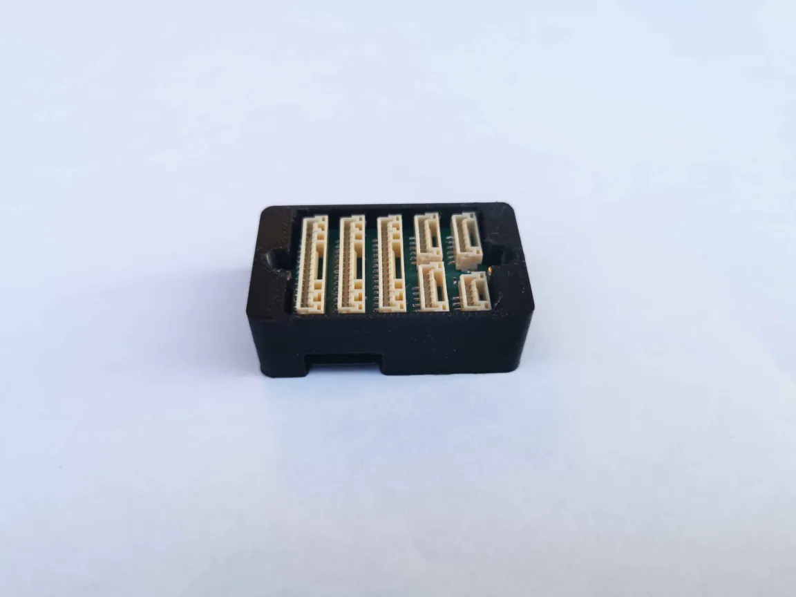
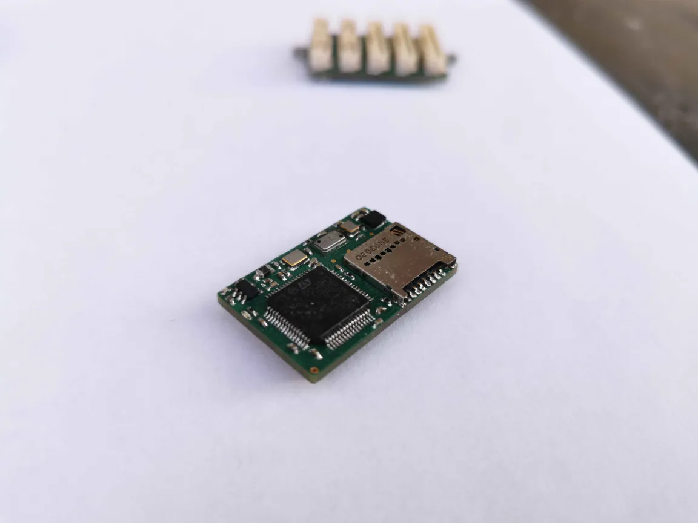
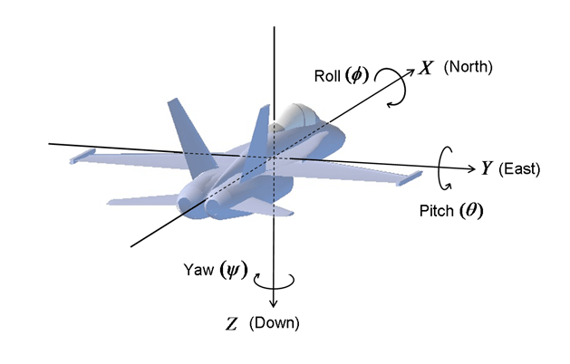

# Autopilot Documentation

  
  

# Coordinate System

# Software Architecture

# State Machine

**Manual Modes**
- **Manual:** The pilot's control inputs (raw user inputs from RC transmitter) are passed directly to servos. No sensor feedback is used.
- **Stabilized:** The pilot directly commands the roll and pitch angle. Thrust is directly set by the pilot.

**Auto Modes**
- **Takeoff:** The throttle is set to the takeoff thrust and the plane holds a 10 degree pitch angle. Once the altitude is above the takeoff altitude threshold, the plane switches to cruise mode.
- **Cruise:** Waypoint following
- **Land:**

**Navigation**
- **Estimator Initilization:** INS alignment

# Controller Diagrams

# Parameters and Configurations

# System Startup

# Telemetry

# TODO
- Telemetry
- Switching between manual and auto flight state
- Use Python to read data log in micro-SD card
